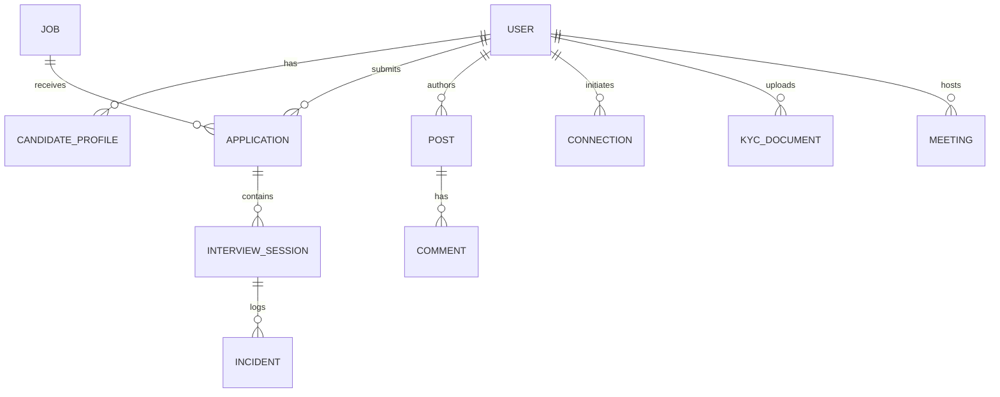

# Functional Requirements Document (FRD)
## Recruitment Automation Platform (RAP) — Candidate & Career Portal
**Project Codename**: Gettin Candidates / RAS Candidate UI  
**Document Version**: 1.0.0  
**Document Status**: Approved / Baseline  
**Date**: August 2026  
**Target Audience**: Product Managers, Software Engineers, QA Engineers, System Architects, Compliance & Hiring Panels  

---

## 1. Document Control & Metadata

### 1.1 Revision History
| Version | Date | Author / Contributor | Description of Changes |
| :--- | :--- | :--- | :--- |
| **1.0.0** | 2026-08-30 | Lead Product & AI Architect | Initial Baseline Functional Requirements Document covering full lifecycle candidate portal, backend APIs, WebRTC signaling, AI proctoring, 11-stage pipeline, KYC OTP hub, and communication dispatches. |

### 1.2 Purpose & Scope
This Functional Requirements Document (FRD) specifies the complete functional, technical, behavioral, and architectural requirements for the **Recruitment Automation Platform (RAP)**. It serves as the single source of truth for engineering implementation, quality assurance test matrices, compliance verification, and stakeholder alignment.

---

## 2. Product Vision & Executive Summary

The **Recruitment Automation Platform (RAP)** is an enterprise-grade, full-lifecycle career and talent acquisition software platform. It bridges candidates, recruiter panels, and AI evaluators in a unified ecosystem designed to eliminate hiring friction, enforce response velocity, and ensure verified credentialing.

### Key Pillars:
1. **Intelligent Application Automation**: 1-Click compatibility-based auto-apply with triggered multi-channel dispatches (HTML Email & WhatsApp).
2. **Deterministic Response SLAs**: 11-stage transparent application lifecycle tracking governed by strict 24-hour recruiter response SLAs.
3. **Trust & Privacy Shielding**: Recruiter panel contact masking (obfuscating email & phone) paired with OTP-authorized multi-document KYC verification.
4. **Autonomous AI Evaluation & In-Platform Telephony**: Real-time AI voice screening (Sarah), WebRTC browser-native live meetings, and vision/gaze-monitored proctored technical interview simulations with verbatim transcript diarization.
5. **Interactive Talent Ecosystem**: Dual-audience recruitment feed (Candidate Showcases & Company Hiring Announcements) and verified peer-to-peer networking.

---

## 3. User Personas & Stakeholders

| Persona | Role Description | Key Motivations & Responsibilities |
| :--- | :--- | :--- |
| **Candidate (Job Seeker)** | Engineering & professional talent seeking job opportunities. | Build portfolio, automate job applications, attend live/AI interviews, complete KYC, safeguard personal contact info, and track progress transparently. |
| **Recruiter / Hiring Manager** | Corporate recruiter or technical panel member. | Review anonymized candidate dossiers, evaluate competency scorecards, inspect proctored interview recordings, schedule rounds, and verify KYC. |
| **AI Talent Agent ("Sarah")** | Autonomous conversational voice & text intelligence. | Conduct structured initial phone screens, evaluate technical answers, log proctoring incidents, compute ATS compatibility scores, and assist candidate workflows. |
| **Platform Administrator** | Compliance, Trust, and System Administrator. | Audit KYC verification records, monitor SLA breaches, maintain platform health, and manage system security policies. |

---

## 4. System Architecture & Tech Stack

```
+-----------------------------------------------------------------------------------+
|                                 CLIENT LAYER                                      |
|  React 18 (TypeScript) | Vite 5 | Tailwind CSS | Lucide React | React Router v6    |
|  Web Speech API (STT/TTS) | WebRTC PeerConnection | LocalStorage Hybrid Cache     |
+----------------------------------------+------------------------------------------+
                                         |
                       REST API / HTTPS  |  WebSockets (ws://)
                                         v
+-----------------------------------------------------------------------------------+
|                                 SERVER LAYER                                      |
|  Node.js + Express 4 (TypeScript / tsx) | Socket.io 4.7.5 | Helmet | CORS | JWT   |
|  Controllers: Auth, Jobs, Applications, Posts, Connections, Documents, Meetings, AI|
+--------------------+-------------------+--------------------+---------------------+
                     |                   |                    |
                     v                   v                    v
+---------------------------+ +---------------------+ +----------------------------+
|     CLOUD ASSETS CDN      | |  DATABASE & AUTH    | |      AI SPEECH & VISION    |
| Cloudinary REST API       | | Firebase Firestore  | | Real-time Gaze/Face Tracker|
| (Resumes, Avatars, Docs)  | | Firebase Auth Engine| | Web Speech Engine / Prompts|
+---------------------------+ +---------------------+ +----------------------------+
```

### Technology Matrix
- **Frontend**: React 18.2, TypeScript 5.6, Vite 5.3, Tailwind CSS 3.4, Lucide-React 0.268, React Router v6.14.
- **Backend**: Node.js 20+, Express 4.19, TypeScript 5.5, tsx, Socket.io 4.7, Helmet 7.1, CORS, Bcryptjs 2.4, JSONWebToken 9.0, UUID v10.
- **Data & Persistence**: Firebase Firestore, Firebase Authentication, in-memory backend stores with client LocalStorage hybrid failover.
- **Media & CDN**: Cloudinary Media Storage (PDFs, KYC images, Avatars, Video recording URLs).
- **Audio & Video**: WebRTC (RTCPeerConnection, STUN/TURN), Web SpeechSynthesis & Web SpeechRecognition.

---

## 5. Functional Requirements by Module

```
                                  RAP MODULE MAP
+--------------------------------------------------------------------------------+
|  [1. Auth & Identity]      [2. Profile & Privacy]    [3. Jobs Marketplace]     |
|  [4. Auto-Apply Engine]    [5. 11-Stage Pipeline]    [6. WebRTC Live Meetings] |
|  [7. Proctored AI Session] [8. Voice Screening]      [9. Multi-Doc KYC Hub]    |
|  [10. Community Posts]     [11. Connections Network] [12. AI Career Copilot]   |
+--------------------------------------------------------------------------------+
```

---

### Module 1: Authentication & Identity Management

| Requirement ID | Requirement Name | Description | Priority |
| :--- | :--- | :--- | :--- |
| **FR-1.1** | **User Registration** | The system must allow candidates to register with `name`, `email`, `password`, and confirm password. Passwords must be hashed using `bcryptjs` (salt rounds: 10). | **Must Have** |
| **FR-1.2** | **Secure Login & JWT** | The system must validate credentials against the user store and issue a signed JSON Web Token (JWT) with standard expiration (24 hours). | **Must Have** |
| **FR-1.3** | **Quick Demo Login** | The login interface must provide a 1-click **"⚡ Quick Demo Login (Avinash Tiwari)"** button pre-configured with default candidate credentials (`avinashtiwari@gmail.com` / `Candidate@123`). | **Must Have** |
| **FR-1.4** | **Role-Based Access** | The system must distinguish between `candidate`, `recruiter`, and `admin` roles, guarding private candidate routes appropriately. | **Must Have** |
| **FR-1.5** | **Session Persistence** | User session state (Token, User Profile, Auth State) must persist across browser reloads via a synchronized AuthContext and LocalStorage cache. | **Must Have** |
| **FR-1.6** | **Graceful Logout** | The system must invalidate client-stored JWT tokens, purge cached session states, and redirect the user to the `/login` route. | **Must Have** |

---

### Module 2: Candidate Profile & Privacy Shield System

| Requirement ID | Requirement Name | Description | Priority |
| :--- | :--- | :--- | :--- |
| **FR-2.1** | **Profile Data Structure** | The candidate profile must support: `headline`, `bio`, `location`, `currentRole`, `totalExperienceYears`, `currentSalaryLPA`, `expectedSalaryLPA`, `noticePeriodDays`, `skills` array, `tools` array, `languages` array, `education` entries, `experience` entries, and `projects` entries. | **Must Have** |
| **FR-2.2** | **Contact Privacy Masking** | When `contactPrivacyMask` is enabled (default `true`), all direct contact information (personal email and mobile phone) must be masked (e.g. `a*****i@gmail.com`, `+91 98****4321`) when viewed by employer panels or non-connected users. | **Must Have** |
| **FR-2.3** | **"View as Recruiter" Preview** | The profile interface must provide an interactive toggle allowing candidates to preview their profile exactly as seen by employer panels, hiding direct contact data while highlighting simulated panel action triggers (*Schedule Round*, *Shortlist*, *Request KYC*). | **Must Have** |
| **FR-2.4** | **ATS Score Engine** | The system must dynamically compute an ATS Optimization Score (0–100%) based on profile completeness, skill coverage, quantified project descriptions, and experience logs. | **Should Have** |
| **FR-2.5** | **Cloudinary Media Upload** | Candidate profile pictures and PDF resumes must be uploadable directly via Cloudinary CDN unsigned upload endpoints, persisting secure HTTPS URLs. | **Must Have** |
| **FR-2.6** | **Privacy Settings Matrix** | Candidates must be able to configure: `profileVisibility` (`public`, `connections_only`, `private`), `showEmailToConnections`, `showPhoneToConnections`, and `allowConnectionRequests`. | **Should Have** |

---

### Module 3: Jobs Marketplace & Company Rating Engine

| Requirement ID | Requirement Name | Description | Priority |
| :--- | :--- | :--- | :--- |
| **FR-3.1** | **Curated Job Catalog** | The system must display active job listings with `title`, `company`, `location`, `workType` (`Remote`, `Hybrid`, `On-site`), `jobType` (`Full-time`, `Contract`), salary range (`salaryMin` - `salaryMax` LPA), experience range (`experienceMin` - `experienceMax` years), and required skill tags. | **Must Have** |
| **FR-3.2** | **Company Hiring Ratings** | The system must calculate and display an objective **Company Hiring Rating** (e.g., `4.9 ★`) alongside response velocity badges (*"99% Response Rate"*, *"Fast Responder <12h"*, *"Same-Day Reply"*). | **Must Have** |
| **FR-3.3** | **Hiring Period Badges** | Every job card must display a verified joining timeline badge: *"Immediate (0-15 Days)"*, *"Urgent Joining (7 Days)"*, *"30 Days Notice Accepted"*, or *"Cohort Joining (Q3)"*. | **Must Have** |
| **FR-3.4** | **Dynamic Multi-Filter Engine** | Candidates must be able to filter jobs by Keyword/Role, Location, Work Type, Joining Period, Salary Range, and sort by Hiring Rating or Recency. | **Must Have** |
| **FR-3.5** | **1-Click Direct Application** | Candidates must be able to apply to any active job with a single click, instantly registering an entry in the 11-Stage Application Pipeline. | **Must Have** |
| **FR-3.6** | **Job Details Deep Dive** | Clicking a job card must open a comprehensive details view displaying key responsibilities, requirements, benefits, hiring team SLA commitments, and an ATS compatibility breakdown. | **Must Have** |

---

### Module 4: Auto-Apply Automation Engine & Notification Dispatches

| Requirement ID | Requirement Name | Description | Priority |
| :--- | :--- | :--- | :--- |
| **FR-4.1** | **Compatibility Match Engine** | The system must evaluate candidate profile attributes against job descriptions and compute an automated match score (0–100%). | **Must Have** |
| **FR-4.2** | **Configurable Auto-Apply Rules** | Candidates must be able to enable Auto-Apply with custom thresholds (e.g., Minimum Match Score >= 80%, Maximum Applications per Day, Target Locations, Preferred Work Types). | **Must Have** |
| **FR-4.3** | **Triggered HTML Email Notification** | Upon successful auto-application, the system must trigger a rich HTML email dispatch containing: Company Name, Role Title, Application Timestamp, 24h Recruiter Response SLA, and ATS Compatibility Percentage. | **Must Have** |
| **FR-4.4** | **Triggered WhatsApp Notification** | Upon successful auto-application, the system must trigger a mobile WhatsApp message alert containing: Company Name, Role, Match Score, Resume Version attached, and a direct portal tracking link. | **Must Have** |
| **FR-4.5** | **Dispatch Audit Feed & Lightbox** | The Auto-Apply dashboard must feature a dedicated **"Triggered Email & WhatsApp Dispatches"** audit log, with an interactive preview modal displaying the exact HTML email markup and green WhatsApp chat bubble UI. | **Must Have** |
| **FR-4.6** | **Execution Log & Toggle** | Candidates must be able to toggle Auto-Apply on/off instantly and inspect historic auto-applied counts and success rates. | **Must Have** |

---

### Module 5: 11-Stage Application Lifecycle & 24h SLA Engine

```
                                APPLICATION LIFECYCLE (11 STAGES)
+----------------------------------------------------------------------------------------------------+
| 1. Submitted  -->  2. Resume Screening  -->  3. AI Screening  -->  4. Shortlisted                 |
|                                                                          |                         |
| 7. Completed  <--  6. In Progress       <--  5. Scheduled     <----------+                         |
|      |                                                                                             |
|      v                                                                                             |
| 8. Under Review  -->  9. Selected / Offer  |  10. Rejected  |  11. On Hold                         |
+----------------------------------------------------------------------------------------------------+
```

| Requirement ID | Requirement Name | Description | Priority |
| :--- | :--- | :--- | :--- |
| **FR-5.1** | **11-Stage Pipeline Tracking** | The system must track applications across exactly 11 deterministic stages: `Application Submitted`, `Resume Screening`, `AI Screening`, `Shortlisted`, `Interview Scheduled`, `Interview in Progress`, `Interview Completed`, `Under Review`, `Selected / Offer`, `Rejected`, `On Hold`. | **Must Have** |
| **FR-5.2** | **24-Hour Recruiter Response SLA** | Every application must maintain a `slaExpiresAt` countdown timer (calculated as `appliedAt + 24 hours`). A live visual timer must display remaining hours/minutes. | **Must Have** |
| **FR-5.3** | **SLA Breach & Escalation Badges** | If a recruiter does not take action within 24 hours, the status must visually flag *"SLA Escalated"* with high-priority review indicators. | **Must Have** |
| **FR-5.4** | **Stage-Specific Action Matrix** | The application card must dynamically render contextual primary actions based on stage: <br>• *AI Screening* $\rightarrow$ **Launch AI Voice Call**<br>• *Interview Scheduled* $\rightarrow$ **Join Live Meeting**<br>• *Interview Completed* $\rightarrow$ **Watch Recording & Transcripts**<br>• *Under Review / Offer* $\rightarrow$ **Upload KYC Verification Docs** | **Must Have** |
| **FR-5.5** | **Stage Audit History** | Each application record must store a chronological `stageHistory` array containing `stage`, `timestamp`, and `note`. | **Must Have** |
| **FR-5.6** | **Kanban & List Views** | Candidates must be able to switch between an interactive Kanban Board grouped by lifecycle stage and a structured tabular list view. | **Should Have** |

---

### Module 6: In-Platform Live Meetings & WebRTC Video Conferencing

| Requirement ID | Requirement Name | Description | Priority |
| :--- | :--- | :--- | :--- |
| **FR-6.1** | **Direct Browser Telephony** | The platform must support native browser-to-browser video and audio meetings without requiring external software (e.g., Zoom/Teams). | **Must Have** |
| **FR-6.2** | **Room Creation & Joining** | Users must be able to generate instant meeting rooms with unique 6-digit/alphanumeric codes (`/meeting/room/:id` or `/interview/room/:id`) or schedule upcoming rounds. | **Must Have** |
| **FR-6.3** | **WebRTC Signaling Protocol** | The backend Socket.io server must orchestrate peer signaling: `join-room`, `user-connected`, `offer`, `answer`, `ice-candidate`, `user-disconnected`. | **Must Have** |
| **FR-6.4** | **AV Stream Controls** | Participants must have interactive controls to toggle Microphone (Mute/Unmute), Camera (On/Off), Screen Sharing, and End Call. | **Must Have** |
| **FR-6.5** | **In-Call Real-Time Chat** | Meeting participants must be able to exchange real-time text messages and code snippets within the meeting room sidebar. | **Must Have** |
| **FR-6.6** | **In-Call Notes & Bookmarks** | Candidates and interviewers must be able to take timestamped private notes during the live call. | **Should Have** |
| **FR-6.7** | **Pre-Join Audio/Video Diagnostics** | The system must provide a Pre-Join Lobby (`/meetings/prejoin/:id`) to test camera feed, microphone levels, and speaker output before entering the room. | **Must Have** |

---

### Module 7: AI-Proctored Interview Simulator & Recorded Talks Archive

| Requirement ID | Requirement Name | Description | Priority |
| :--- | :--- | :--- | :--- |
| **FR-7.1** | **Multi-Category AI Interview Simulator** | The system must conduct structured mock interviews across categories: `Technical`, `Behavioral`, `System Design`, `HR`, or `Mixed`. | **Must Have** |
| **FR-7.2** | **Real-Time Speech Engine** | The simulator must utilize Speech-to-Text (STT) for live candidate transcription and Text-to-Speech (TTS) for natural AI question delivery. | **Must Have** |
| **FR-7.3** | **Live Vision & Gaze Proctoring** | The simulator must analyze the candidate camera feed in real time, detecting: `gaze_diverted`, `face_turned_away`, `multiple_faces`, `no_face_detected`, and `tab_switched`. | **Must Have** |
| **FR-7.4** | **3-Strike Disqualification System** | Any proctoring violation must trigger an on-screen warning banner and increment the strike count. On the 3rd strike, the session must be automatically terminated with status `terminated_violations`. | **Must Have** |
| **FR-7.5** | **Tab Switch Detection** | Switching away from the active browser tab or minimizing the window must immediately log a critical `tab_switched` incident. | **Must Have** |
| **FR-7.6** | **Cloud Recording Active Indicator** | An overlay indicator (`🔴 REC · Cloud Recording Active`) must remain visible throughout the session to ensure compliance transparency. | **Must Have** |
| **FR-7.7** | **Turn-by-Turn Diarized Transcripts** | The system must record and index dialogue turn-by-turn with speaker diarization badges (*AI Technical Evaluator*, *Candidate*, *Hiring Panel*). | **Must Have** |
| **FR-7.8** | **Competency Scorecard Analysis** | Post-interview, the AI engine must compute multi-dimensional competency scores (e.g. Technical Depth, Problem Solving, Communication, System Architecture) with qualitative feedback. | **Must Have** |
| **FR-7.9** | **Recorded Talks Archive Player** | Completed sessions must be stored in the Recorded Talks Archive (`/meetings`), featuring an interactive video replay player, audio scrubber, transcript sync, and proctoring log inspector. | **Must Have** |
| **FR-7.10** | **Transcript Export** | Users and recruiters must be able to export the complete interview transcript as a formatted `.txt` or `.json` file. | **Should Have** |

---

### Module 8: AI Voice Screening Call Simulator

| Requirement ID | Requirement Name | Description | Priority |
| :--- | :--- | :--- | :--- |
| **FR-8.1** | **Interactive Phone Call Interface** | The system must provide a simulated mobile dialer / phone call UI with answer, decline, mute, and hang-up controls. | **Must Have** |
| **FR-8.2** | **Sarah AI Talent Partner** | The AI screening persona must conduct an autonomous HR phone screen covering: Self-Introduction, Notice Period, Current vs Expected CTC, Relocation Preferences, and Technical Background. | **Must Have** |
| **FR-8.3** | **Real-Time Audio Waveform** | The call UI must render an animated frequency visualizer reacting to live microphone input and synthetic speech output. | **Must Have** |
| **FR-8.4** | **Real-Time Transcript Feed** | Speech turns between Sarah and the candidate must stream in real time in a dual-bubble conversation feed. | **Must Have** |
| **FR-8.5** | **Call Summary & Readiness Score** | At call termination, the system must generate a structured screening summary with candidate readiness score and auto-advance the application to `AI Screening -> Completed`. | **Must Have** |

---

### Module 9: Multi-Document KYC Hub & OTP Verification

| Requirement ID | Requirement Name | Description | Priority |
| :--- | :--- | :--- | :--- |
| **FR-9.1** | **Supported KYC Document Types** | The system must support uploads for: `Aadhaar Card`, `PAN Card`, `Degree Certificate`, `Experience / Relieving Letter`, and `Recent Salary Slips (Last 3 Months)`. | **Must Have** |
| **FR-9.2** | **6-Digit OTP Authorization Gate** | Document submission and verification workflows must be strictly gated behind a 6-digit OTP verification modal (Default test passcode: `123456`). | **Must Have** |
| **FR-9.3** | **Government ID Masking** | Document identification numbers (Aadhaar/PAN) must be stored and displayed in masked format (e.g. `XXXX-XXXX-1234`, `ABCDE****F`) to maintain PII compliance. | **Must Have** |
| **FR-9.4** | **Verification Status Lifecycle** | Each uploaded record must maintain a verified state: `Pending Verification`, `Verified`, or `Rejected`. | **Must Have** |
| **FR-9.5** | **Discrepancy Resolution Panel** | When a recruiter flags a discrepancy, the system must render the recruiter's discrepancy note and provide an inline re-upload and candidate clarification response channel. | **Must Have** |
| **FR-9.6** | **Cloudinary Secure Document CDN** | Document files (PDF, PNG, JPG) must be synced directly to Cloudinary storage and indexed with document metadata in the database. | **Must Have** |

---

### Module 10: Community Posts & Recruitment Feed

| Requirement ID | Requirement Name | Description | Priority |
| :--- | :--- | :--- | :--- |
| **FR-10.1** | **Dual-Audience Feed** | The feed must support posts from both **Verified Companies** (Hiring sprints, engineering culture, tech blogs) and **Candidates** (Project showcases, STAR interview breakdowns, career advice). | **Must Have** |
| **FR-10.2** | **"+ Add Post" Creator** | The post builder must support: Multi-category selection (`Case Study`, `Interview Experience`, `Hiring Announcement`, `Technical Article`, `General`), rich text descriptions, image attachments, and verified link buttons. | **Must Have** |
| **FR-10.3** | **Author Mode Switch** | Authors must be able to toggle between "Post as Candidate" and "Post as Company" (displaying company hiring ratings). | **Must Have** |
| **FR-10.4** | **Verified Links Integration** | Posts can include structured external links with dedicated badges: GitHub Repository, Live Demo, Portfolio URL, Tech Blog, or 1-Click Job Application. | **Must Have** |
| **FR-10.5** | **Autocomplete Tags & Instant Filtering** | The post creator must offer autocomplete hashtag suggestions (`#hiring`, `#react`, `#systemdesign`), and feed users must be able to filter the feed by clicking any tag. | **Must Have** |
| **FR-10.6** | **Social Interactions** | Posts must support like toggling with heart animation, bookmarking, and nested comments with instant reply submission. | **Must Have** |

---

### Module 11: Professional Connections & Networking

| Requirement ID | Requirement Name | Description | Priority |
| :--- | :--- | :--- | :--- |
| **FR-11.1** | **Connection Requests** | Candidates must be able to send, accept, decline, and withdraw connection requests to other users on the platform. | **Must Have** |
| **FR-11.2** | **Privacy-Gated Contact Unlocking** | Direct contact information is only revealed between confirmed connections if `showEmailToConnections` or `showPhoneToConnections` is explicitly permitted. | **Must Have** |
| **FR-11.3** | **Network Discovery Directory** | Users must be able to search and discover fellow candidates and hiring panel members by skill, current company, role, or location. | **Must Have** |
| **FR-11.4** | **User Profile Deep-Link View** | Clicking any member card (`/user/:userId`) must open their public candidate portfolio view with connection status badges. | **Must Have** |

---

### Module 12: AI Career Copilot & Guided Workflow Wizards

| Requirement ID | Requirement Name | Description | Priority |
| :--- | :--- | :--- | :--- |
| **FR-12.1** | **Natural Language Copilot Chat** | The system must feature an AI Career Copilot (`/ai-agent`) capable of answering user queries regarding application statuses, resume improvements, interview tips, and platform navigation. | **Must Have** |
| **FR-12.2** | **Interactive Workflow Wizards** | The Copilot must provide step-by-step guided wizards for: <br>1. *Portfolio Setup Wizard* (Headline, Experience, Skills, Project showcase)<br>2. *Auto-Apply Configuration Wizard* (Filters, Thresholds, Dispatches)<br>3. *Interview Preparation Wizard* (Topic selection, Mock simulations). | **Must Have** |
| **FR-12.3** | **Actionable Quick Suggestions** | The Copilot must analyze the current user profile state and suggest high-impact actions (e.g. "Your ATS score is 68%. Add 2 cloud skills to boost it to 85%"). | **Should Have** |

---

## 6. Data Models & Entity Relationships



### Core Schema Definitions

```typescript
// 1. User Account
interface User {
  id: string;
  email: string;
  name: string;
  passwordHash: string;
  role: 'candidate' | 'recruiter' | 'admin';
  createdAt: string;
  updatedAt: string;
}

// 2. Candidate Profile & Privacy
interface CandidateProfile {
  id: string;
  userId: string;
  name: string;
  email: string;
  phone: string;
  headline: string;
  bio: string;
  location: string;
  currentRole?: string;
  totalExperienceYears: number;
  currentSalaryLPA: number;
  expectedSalaryLPA: number;
  noticePeriodDays: number;
  skills: string[];
  tools: string[];
  languages: string[];
  profilePhoto: string;
  resumeUrl?: string;
  atsScore: number;
  contactPrivacyMask: boolean;
  privacySettings?: {
    profileVisibility: 'public' | 'connections_only' | 'private';
    showEmailToConnections: boolean;
    showPhoneToConnections: boolean;
    allowConnectionRequests: boolean;
    contactPrivacyMask: boolean;
  };
  education?: EducationEntry[];
  experience?: ExperienceEntry[];
  projects?: ProjectEntry[];
  githubUrl?: string;
  linkedinUrl?: string;
  portfolioUrl?: string;
}

// 3. Job Entity
interface Job {
  id: string;
  title: string;
  company: string;
  companyLogo?: string;
  location: string;
  workType: 'Remote' | 'Hybrid' | 'On-site';
  jobType: 'Full-time' | 'Contract' | 'Part-time';
  salaryMin: number;
  salaryMax: number;
  experienceMin: number;
  experienceMax: number;
  hiringRating: number;
  hiringPeriod: 'Immediate' | '15 Days' | '30 Days' | '45+ Days';
  description: string;
  responsibilities: string[];
  requirements: string[];
  skillsRequired: string[];
  applicantsCount: number;
  createdAt: string;
}

// 4. 11-Stage Application
interface Application {
  id: string;
  jobId: string;
  candidateId: string;
  jobTitle: string;
  company: string;
  currentStage: ApplicationStage;
  appliedAt: string;
  updatedAt: string;
  slaExpiresAt: string;
  recruiterNotes?: string;
  interviewDate?: string;
  stageHistory: {
    stage: ApplicationStage;
    timestamp: string;
    note?: string;
  }[];
}

// 5. KYC Document Record
interface KYCDocument {
  id: string;
  candidateId: string;
  documentType: 'Aadhaar Card' | 'PAN Card' | 'Degree Certificate' | 'Experience Letter' | 'Salary Slips';
  documentNumberMasked: string;
  fileUrl: string;
  verifiedStatus: 'Verified' | 'Pending Verification' | 'Rejected';
  otpVerified: boolean;
  discrepancyNote?: string;
  uploadedAt: string;
}

// 6. Interview & Proctoring Record
interface InterviewSessionRecord {
  id: string;
  candidateId: string;
  interviewType: 'Technical' | 'Behavioral' | 'HR' | 'Mixed' | 'System Design';
  totalQuestions: number;
  completedQuestions: number;
  overallScore: number;
  status: 'in_progress' | 'completed' | 'terminated_violations' | 'terminated_tab_switch';
  answers: {
    questionId: string;
    prompt: string;
    category: string;
    answeredText: string;
    durationSeconds: number;
    aiScore?: number;
    aiFeedback?: string;
  }[];
  incidents: {
    id: string;
    type: 'gaze_diverted' | 'face_turned_away' | 'multiple_faces' | 'no_face_detected' | 'tab_switched';
    timestamp: string;
    strikeNumber: number | 'DISQUALIFIED';
    severity: 'warning' | 'critical' | 'termination';
  }[];
  startedAt: string;
  completedAt?: string;
}
```

---

## 7. API Specifications & WebSocket Protocols

### 7.1 REST Endpoints Summary

| Method | Endpoint | Description | Auth Required |
| :--- | :--- | :--- | :--- |
| `POST` | `/api/v1/auth/register` | Register new user | No |
| `POST` | `/api/v1/auth/login` | Authenticate user & issue JWT | No |
| `GET` | `/api/v1/auth/me` | Fetch authenticated user context | Yes (JWT) |
| `GET` | `/api/v1/jobs` | Retrieve filtered jobs catalog | No |
| `GET` | `/api/v1/jobs/:id` | Retrieve single job details | No |
| `POST` | `/api/v1/jobs` | Create new job post | Yes (Recruiter) |
| `GET` | `/api/v1/applications` | List user applications & SLA timers | Yes |
| `POST` | `/api/v1/applications` | Submit application (Direct or Auto-Apply)| Yes |
| `PATCH` | `/api/v1/applications/:id/stage` | Advance application lifecycle stage | Yes (Recruiter/AI) |
| `GET` | `/api/v1/posts` | Get recruitment & community feed | No |
| `POST` | `/api/v1/posts` | Publish new post with verified links | Yes |
| `POST` | `/api/v1/posts/:id/like` | Toggle post like state | Yes |
| `POST` | `/api/v1/posts/:id/comment`| Add comment to post thread | Yes |
| `GET` | `/api/v1/connections` | List user connections & pending invites| Yes |
| `POST` | `/api/v1/connections/request`| Send connection request | Yes |
| `POST` | `/api/v1/connections/:id/accept`| Accept connection request | Yes |
| `GET` | `/api/v1/documents` | Fetch candidate KYC documents | Yes |
| `POST` | `/api/v1/documents/upload`| Upload new KYC doc with OTP flag | Yes |
| `POST` | `/api/v1/documents/verify-otp`| Verify 6-digit OTP passcode (`123456`)| Yes |
| `GET` | `/api/v1/meetings` | Retrieve scheduled & recorded meetings| Yes |
| `POST` | `/api/v1/meetings/create` | Create new instant/scheduled meeting | Yes |
| `POST` | `/api/v1/ai/voice-screen` | Process voice screening transcript | Yes |
| `POST` | `/api/v1/ai/evaluate-answer`| Score interview answer & give feedback | Yes |

### 7.2 WebSocket Signaling Events (`ws://localhost:5000`)

```
+-------------------+                          +-------------------+
|  Candidate Client |                          |   Peer / Panel    |
+---------+---------+                          +---------+---------+
          |                                              |
          | ---- 1. join-room(roomId, userId) ---------> |
          | <--- 2. user-connected(newUserId) ---------- |
          |                                              |
          | ---- 3. offer(sdpOffer, toUserId) ---------> |
          | <--- 4. answer(sdpAnswer, fromUserId) ------ |
          |                                              |
          | <---> 5. ice-candidate(candidate) <--------> |
          |                                              |
          | <===> 6. Peer-to-Peer Encrypted Media <====> |
          |                                              |
          | ---- 7. chat-message / notes --------------> |
          | ---- 8. leave-room ------------------------> |
```

---

## 8. Non-Functional Requirements (NFRs)

### 8.1 Performance & Latency
- **NFR-1.1**: Page initial load and route transition times must be under **1.5 seconds** on broadband connections.
- **NFR-1.2**: In-meeting WebRTC media latency must not exceed **200ms** in peer-to-peer network topology.
- **NFR-1.3**: Speech-to-Text conversion latency must stream candidate utterances within **300ms** of speech pauses.

### 8.2 Security & Data Privacy (PII Protection)
- **NFR-2.1**: Personal Identifiable Information (email, phone, government ID numbers) must be masked in recruiter previews by default.
- **NFR-2.2**: Backend endpoints must enforce HTTP security headers using `helmet` and restrict origin requests via `cors`.
- **NFR-2.3**: Password hashing must be enforced via `bcryptjs` with salt rounds $\ge 10$.
- **NFR-2.4**: KYC verification submission must mandate 6-digit OTP authorization before document indexing.

### 8.3 Reliability & Offline Resilience
- **NFR-3.1**: The frontend must utilize a resilient hybrid persistence model (Firebase Firestore + synchronized LocalStorage fallback), ensuring zero data loss if network partitions occur.
- **NFR-3.2**: WebRTC connection dropouts must trigger automatic ICE reconnection attempts without terminating the meeting room state.

### 8.4 UI/UX & Accessibility Standards
- **NFR-4.1**: User interfaces must adopt a sleek modern dark/vibrant design with glassmorphic cards, smooth hover transitions, and distinct status color codes.
- **NFR-4.2**: Semantic HTML5 elements and unique element identifiers (`id`, `aria-label`) must be present on all interactive controls to facilitate automated browser testing and accessibility.

---

## 9. Verification & Acceptance Criteria Matrix

| Module | Verification Scenario | Expected Result | Pass/Fail Criteria |
| :--- | :--- | :--- | :--- |
| **Auth** | User logs in using Quick Demo credentials. | JWT token stored, user redirected to `/dashboard`, user name "Avinash Tiwari" displayed in navbar. | **Pass**: Successful login & redirect within 500ms. |
| **Privacy Shield** | Recruiter views candidate profile. | Email displays as `a*****i@gmail.com` and phone as `+91 98****4321`. Direct contact buttons hidden. | **Pass**: No plaintext contact data in DOM. |
| **Auto-Apply** | Candidate triggers auto-apply for an 85% match role. | Application created in 11-stage tracker, HTML email preview and WhatsApp green bubble dispatches rendered in Audit Feed. | **Pass**: Dispatches visible in audit modal; SLA timer active. |
| **24h SLA** | Application submitted at `T0`. | Countdown displays `23h 59m remaining` and decrements in real time. | **Pass**: Accurate timestamp countdown. |
| **AI Proctoring** | Candidate switches tab during AI interview session. | System flags `tab_switched` violation, logs incident in scorecard, and increments strike counter. | **Pass**: Strike registered within 200ms. |
| **KYC OTP** | Candidate attempts KYC doc verification with code `123456`. | System validates OTP, updates badge to `Verified`, and removes verification lock. | **Pass**: Status changes to `Verified`. |
| **WebRTC Meeting**| Two users join same room code. | Peer video/audio streams establish bidirectional connection without third-party plugins. | **Pass**: Audio/video active both ways. |

---

## 10. Glossary & Acronyms

- **ATS**: Applicant Tracking System
- **CTC**: Cost to Company (Annual Salary in INR Lakhs / LPA)
- **FRD**: Functional Requirements Document
- **JWT**: JSON Web Token
- **KYC**: Know Your Customer (Identity & Credential Verification)
- **LPA**: Lakhs Per Annum
- **NFR**: Non-Functional Requirement
- **PII**: Personally Identifiable Information
- **RAP / RAS**: Recruitment Automation Platform / Software
- **SLA**: Service Level Agreement
- **STT / TTS**: Speech-to-Text / Text-to-Speech
- **WebRTC**: Web Real-Time Communication
